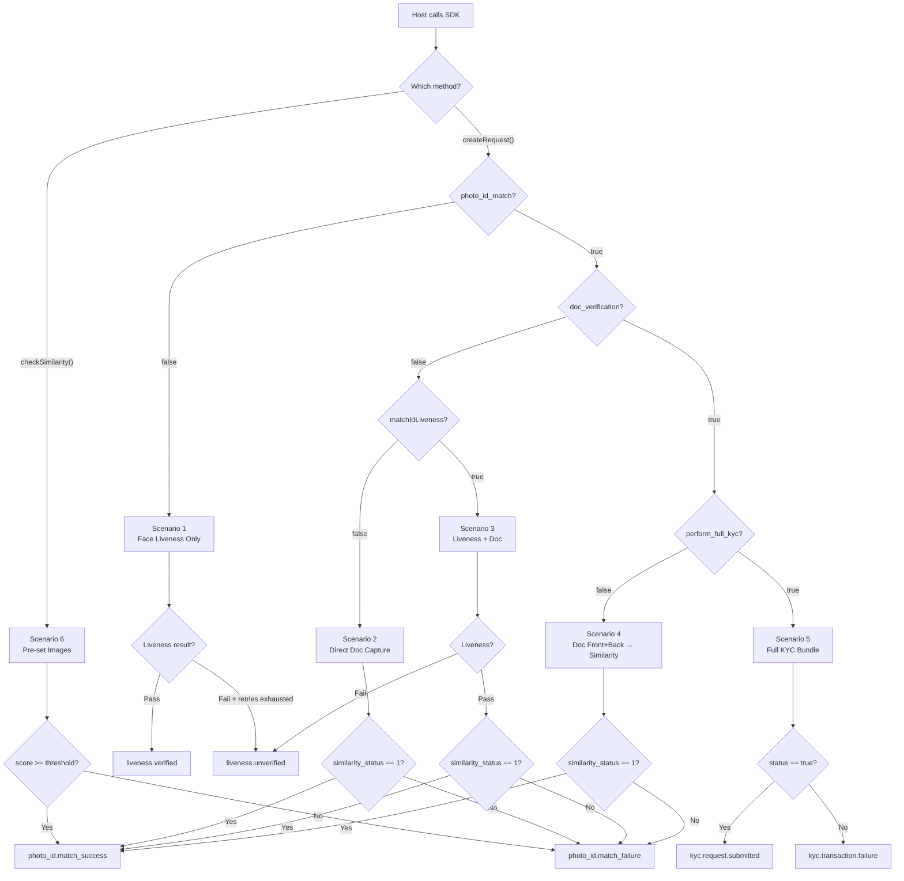

# Config Object → Event Mapping — What the Host App Receives

> Every flow ultimately delivers **one** terminal event to the host via `requestListener.requestStatus()`.  
> This document maps each config combination to the exact flow, API endpoint, and final event.

---

## Key Config Flags That Control the Flow

| Config Key | Type | Default | What It Controls |
|-----------|------|---------|-----------------|
| `photo_id_match` | `bool` | `false` | Sets `serviceType` → `MATCH_TO_PHOTO_ID` (true) or `FACE_LIVENESS` (false) |
| `doc_verification` | `bool` | `false` | Enables front/back document capture after face capture |
| `perform_full_kyc` | `bool` | `false` | Bundles everything into one `/perform-kyc` API call instead of `/check-similarity` |
| `matchIdLiveness` | `bool` | `true` | Whether to run liveness check before doc capture in Photo ID Match. **Auto-forced to `false` when `doc_verification = true`** |
| `livenessType` | `string` | `"DEFAULT"` | `"QUICK"`, `"DETAILED"`, or `"DEFAULT"` (auto-selects based on root status) |
| `livenessRetryFlow` | `bool` | `false` | Enable retry on liveness failure |
| `livenessRetryCount` | `int` | `0` | Max retries (0-5) |
| `documentRetryFlow` | `bool` | `false` | Enable retry on liveness failure in Photo ID Match flow |
| `documentRetryCount` | `int` | `0` | Max retries for doc flow (0-5) |
| `doc_two_verification` | `bool` | `false` | Capture a second document (e.g., utility bill) |
| `address_verification` | `bool` | `false` | Capture an address proof document |
| `doc_AML` | `bool` | `false` | Add AML check to the KYC bundle |

---

## Config Scenarios & Their Terminal Events

---

### Scenario 1 — Pure Face Liveness (No Photo ID Match)

**Config:**
```json
{
  "photo_id_match": false,
  "livenessType": "QUICK"      // or "DETAILED" or "DEFAULT"
}
```

**Effective flags after SDK normalization:**
```
serviceType        = FACE_LIVENESS
doc_verification   = false  (default)
perform_full_kyc   = false  (default)
matchIdLiveness    = true   (default, irrelevant here)
```

**Flow:**
```
Face Capture → Create Transaction API → GET /result (poll)
```

**Possible terminal events:**

| Event | When |
|-------|------|
| `liveness.verified` | `quick_liveness_response == 1` (QL) or `is_request_original == 1` (DL) |
| `liveness.unverified` | `quick_liveness_response != 1` (QL) or `is_request_original == 0` (DL) — after all retries exhausted |
| `error.occurred` | Any API call fails (HTTP error or network) |
| `request.timeout` | Face detection timer expires |
| `request.cancelled` | User exits |

> [!TIP]
> This is the simplest flow. The host **always** gets a liveness event. No similarity score is ever returned.

---

### Scenario 2 — Photo ID Match WITHOUT Liveness (Direct Doc Capture)

**Config:**
```json
{
  "photo_id_match": true,
  "matchIdLiveness": false
}
```

**Effective flags:**
```
serviceType        = MATCH_TO_PHOTO_ID
doc_verification   = false  (default)
perform_full_kyc   = false  (default)
matchIdLiveness    = false  ← skips liveness entirely
```

**Flow:**
```
Face Capture → (NO liveness API call) → Doc Capture → POST /check-similarity
```

**Possible terminal events:**

| Event | When |
|-------|------|
| `photo_id.match_success` | `similarity_status == 1` |
| `photo_id.match_failure` | `similarity_status != 1` |
| `error.occurred` | API error/network failure |
| `request.timeout` | Face detection timer expires |
| `request.cancelled` | User exits |

> [!IMPORTANT]
> **No liveness events are ever fired.** The SDK goes straight from face capture to document capture. The liveness check is completely bypassed.

---

### Scenario 3 — Photo ID Match WITH Liveness (Default)

**Config:**
```json
{
  "photo_id_match": true,
  "matchIdLiveness": true
}
```

**Effective flags:**
```
serviceType        = MATCH_TO_PHOTO_ID
doc_verification   = false  (default)
perform_full_kyc   = false  (default)
matchIdLiveness    = true   ← runs liveness before doc
```

**Flow:**
```
Face Capture → Create Transaction → GET /result (liveness poll)
  → if liveness passes: Doc Capture → POST /check-similarity
  → if liveness fails (retries exhausted): terminates with liveness.unverified
```

**Possible terminal events:**

| Event | When |
|-------|------|
| `photo_id.match_success` | Liveness passed AND `similarity_status == 1` |
| `photo_id.match_failure` | Liveness passed AND `similarity_status != 1` |
| `liveness.unverified` | Liveness failed (all retries exhausted) — **never reaches doc capture** |
| `error.occurred` | API error at any stage |
| `request.timeout` | Face detection timer expires |
| `request.cancelled` | User exits |

> [!WARNING]
> `liveness.verified` is **consumed internally** as a gate. The host NEVER receives it in this flow. If liveness passes, the SDK silently proceeds to doc capture and the host only gets the similarity result.

---

### Scenario 4 — Photo ID Match + Doc Verification (Front/Back Capture, Similarity API)

**Config:**
```json
{
  "photo_id_match": true,
  "doc_verification": true,
  "perform_full_kyc": false
}
```

**Effective flags (after SDK auto-adjustment):**
```
serviceType        = MATCH_TO_PHOTO_ID
doc_verification   = true
perform_full_kyc   = false
matchIdLiveness    = false  ← AUTO-FORCED by CameraFragment (doc_verification overrides this)
```

**Flow:**
```
Face Capture → (NO liveness) → Doc Front Capture → Doc Back Capture (or skip)
  → POST /check-similarity (face_frame + id_frame)
```

> [!IMPORTANT]
> When `doc_verification = true`, the SDK **auto-forces `matchIdLiveness = false`** at [CameraFragment.java:266-271](file:///Users/saadafzaal/Automation%20/PF/gitlab/facia_android_sdk/Facia/src/main/java/com/facia/faciasdk/Camera/CameraFragment.java#L266-L271). This means liveness is always skipped. Even if you explicitly pass `matchIdLiveness: true`, it gets overridden.

**Possible terminal events:**

| Event | When |
|-------|------|
| `photo_id.match_success` | `similarity_status == 1` |
| `photo_id.match_failure` | `similarity_status != 1` |
| `error.occurred` | API error/network failure |
| `request.timeout` | Face detection timer expires |
| `request.cancelled` | User exits |

---

### Scenario 5 — Full KYC (Bundled API Call → `kyc.request.submitted` / `kyc.transaction.failure`)

**Config:**
```json
{
  "photo_id_match": true,
  "doc_verification": true,
  "perform_full_kyc": true
}
```

**Optional add-ons:**
```json
{
  "doc_two_verification": true,    // adds 2nd document capture
  "address_verification": true,    // adds address proof capture
  "doc_AML": true                  // adds AML check to bundle
}
```

**Effective flags:**
```
serviceType        = MATCH_TO_PHOTO_ID
doc_verification   = true
perform_full_kyc   = true
matchIdLiveness    = false  ← AUTO-FORCED (same override as Scenario 4)
```

**Flow:**
```
Face Capture → (NO liveness) 
  → KYC Doc Type Selection Screen
  → Doc Front Capture → Doc Back Capture (or skip for Passport)
  → [Doc Two Front/Back if enabled]
  → [Address Front/Back if enabled]
  → POST /perform-kyc (single bundled JSON payload with all images as base64)
```

**API Payload sent to `/perform-kyc`:**
```json
{
  "services": ["quick_liveness", "document_ocr", "document_verification", "face_match", "aml?", "address_verification?"],
  "quick_liveness": { "file": "data:image/jpeg;base64,..." },
  "document": {
    "file": "data:image/jpeg;base64,...",
    "additional_file": "data:image/jpeg;base64,...",
    "supported_types": ["id_card", "passport", "driving_license"]
  },
  "document_two": { "file": "...", "additional_file": "..." },
  "address": { "file": "...", "additional_file": "..." },
  "device_id": "...",
  "client_reference": "..."
}
```

**Possible terminal events:**

| Event | When |
|-------|------|
| `kyc.request.submitted` | `/perform-kyc` returns HTTP 2xx with `{ "status": true }` |
| `kyc.transaction.failure` | `/perform-kyc` returns HTTP 2xx with `{ "status": false }` |
| `error.occurred` | `/perform-kyc` returns non-2xx HTTP OR network failure |
| `request.timeout` | Face detection timer expires |
| `request.cancelled` | User exits |

> [!IMPORTANT]
> This is the **ONLY** config that triggers `kyc.request.submitted` or `kyc.transaction.failure`. All three flags must be `true`:
> - `photo_id_match = true`
> - `doc_verification = true`  
> - `perform_full_kyc = true`

---

### Scenario 6 — Pre-set Images (Host provides face + ID images)

**Entry point:** `FaciaAi.checkSimilarity(token, activity, faceFile, idFile, threshold, config, listener)`

**Config:** Any config (SDK ignores most flags — the flow is fixed)

**Effective behavior:**
```
requestModel.isSimilarity = true
requestType               = "checkSimilarity"
```

**Flow:**
```
(No camera) → POST /check-similarity (host-provided face_frame + id_frame)
```

**Possible terminal events:**

| Event | When |
|-------|------|
| `photo_id.match_success` | `similarity_score >= threshold` (host-defined) |
| `photo_id.match_failure` | `similarity_score < threshold` |
| `error.occurred` | API error/network failure |

> [!NOTE]
> **Decision uses `similarity_score >= threshold`** (host-provided number), NOT `similarity_status`. This is different from the auto-captured path (Scenarios 2-4) which uses `similarity_status == 1`.

---

## Master Decision Tree



---

## Quick Reference: Config → Terminal Event

| # | `photo_id_match` | `doc_verification` | `perform_full_kyc` | `matchIdLiveness` | API Called | Success Event | Failure Event |
|---|:---:|:---:|:---:|:---:|-----------|---------------|---------------|
| 1 | `false` | – | – | – | `GET /result` | `liveness.verified` | `liveness.unverified` |
| 2 | `true` | `false` | `false` | `false` | `POST /check-similarity` | `photo_id.match_success` | `photo_id.match_failure` |
| 3 | `true` | `false` | `false` | `true` | `GET /result` → `POST /check-similarity` | `photo_id.match_success` | `liveness.unverified` OR `photo_id.match_failure` |
| 4 | `true` | `true` | `false` | ~~any~~ → `false` | `POST /check-similarity` | `photo_id.match_success` | `photo_id.match_failure` |
| 5 | `true` | `true` | `true` | ~~any~~ → `false` | `POST /perform-kyc` | `kyc.request.submitted` | `kyc.transaction.failure` |
| 6 | – (checkSimilarity API) | – | – | – | `POST /check-similarity` | `photo_id.match_success` | `photo_id.match_failure` |

> `error.occurred`, `request.timeout`, `request.cancelled`, `internet.issue`, and `emulator.detected` can happen in **any** scenario.

---

## Auto-Force Rules (SDK overrides your config)

| Condition | Override Applied | Source |
|-----------|-----------------|--------|
| `doc_verification == true` AND `photo_id_match == false` | `doc_verification` → `false`, `address_verification` → `false` | [FaciaAi.java:269-273](file:///Users/saadafzaal/Automation%20/PF/gitlab/facia_android_sdk/Facia/src/main/java/com/facia/faciasdk/FaciaAi.java#L269-L273) |
| `doc_verification == true` AND `MATCH_TO_PHOTO_ID` | `matchIdLiveness` → `false` | [CameraFragment.java:266-271](file:///Users/saadafzaal/Automation%20/PF/gitlab/facia_android_sdk/Facia/src/main/java/com/facia/faciasdk/Camera/CameraFragment.java#L266-L271) |
| `livenessType` not set | `DEFAULT_LIVENESS` (QL on non-rooted, DL on rooted) | [FaciaAi.java:254-263](file:///Users/saadafzaal/Automation%20/PF/gitlab/facia_android_sdk/Facia/src/main/java/com/facia/faciasdk/FaciaAi.java#L254-L263) |
| `address_verification == true` | Only effective when `doc_verification == true` | [CameraFragment.java:262](file:///Users/saadafzaal/Automation%20/PF/gitlab/facia_android_sdk/Facia/src/main/java/com/facia/faciasdk/Camera/CameraFragment.java#L262) |
