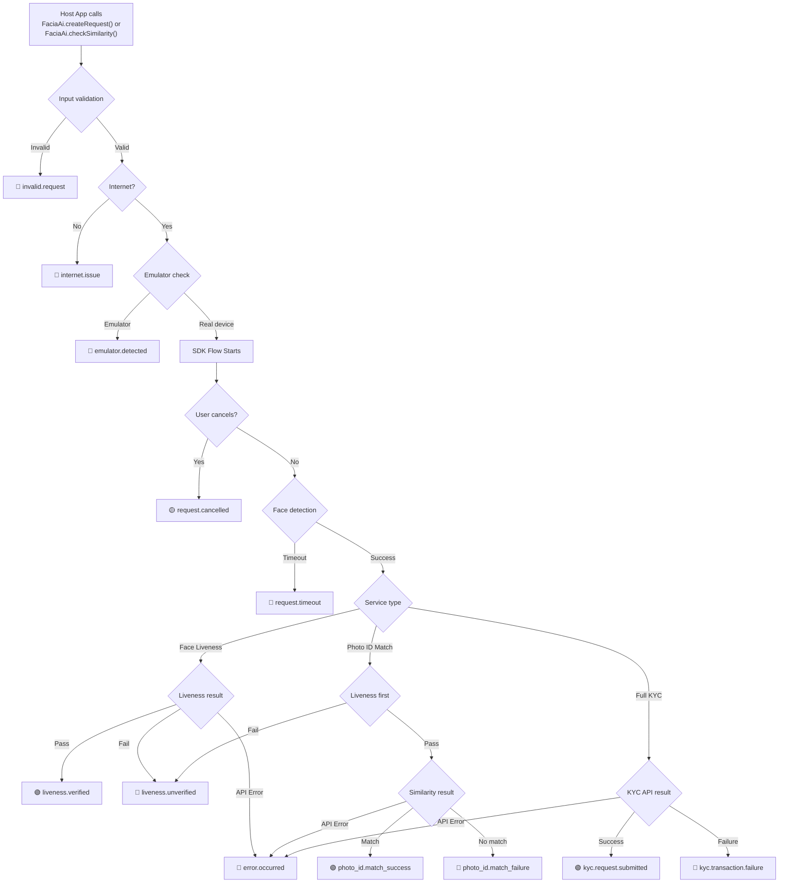

# Facia Android SDK — Host App Events Reference

> **Last updated:** 2026-05-19  
> This document catalogs **every event string** the SDK sends back to the host application via the `RequestListener.requestStatus(HashMap<String, String>)` callback.

---

## Delivery Mechanism

All events are delivered through the single callback interface:

```java
public interface RequestListener {
    void requestStatus(HashMap<String, String> responseSet);
}
```

The `HashMap` always contains an `"event"` key. Depending on the event, it may also include:

| Key                | Type     | Present When                                                 |
|--------------------|----------|--------------------------------------------------------------|
| `event`            | `String` | **Always**                                                   |
| `reference_id`     | `String` | Most events (empty string `""` when not available)           |
| `similarity_score` | `String` | Photo ID Match success/failure events                        |
| `error`            | `String` | `invalid.request` and `error.occurred` (with `clientReference`) |

---

## Complete Event Catalog

### 1. `request.cancelled`

| Attribute   | Details |
|-------------|---------|
| **Category** | User-initiated cancellation |
| **Payload** | `{ event: "request.cancelled", reference_id: "" }` |

**Trigger conditions — User confirms the "Exit" dialog in any of these screens:**

| # | Screen / Class | Trigger |
|---|----------------|---------|
| 1 | **ConsentFragment** | Back-press → exit dialog → "Yes" |
| 2 | **VerificationTypeFragment** | Back-press → exit dialog → "Yes" |
| 3 | **CameraFragment** (via `HelperFunctions.dialogAction`) | Back-press → exit dialog → "Yes" |
| 4 | **DocTypeFragment** | Back-press → exit dialog → "Yes" |
| 5 | **KycDocTypeFragment** | Back-press → exit dialog → "Yes" |
| 6 | **KycDocTwoTypeFragment** | Back-press → exit dialog → "Yes" |
| 7 | **KycAddressTypeFragment** | Back-press → exit dialog → "Yes" |

**Source files:**
- [`ConsentFragment.java:202`](file:///Users/saadafzaal/Automation%20/PF/gitlab/facia_android_sdk/Facia/src/main/java/com/facia/faciasdk/Consent/ConsentFragment.java#L202)
- [`VerificationTypeFragment.java:211`](file:///Users/saadafzaal/Automation%20/PF/gitlab/facia_android_sdk/Facia/src/main/java/com/facia/faciasdk/VerificationType/VerificationTypeFragment.java#L211)
- [`HelperFunctions.java:453`](file:///Users/saadafzaal/Automation%20/PF/gitlab/facia_android_sdk/Facia/src/main/java/com/facia/faciasdk/Camera/HelperFunctions.java#L453)
- [`DocTypeFragment.java:194`](file:///Users/saadafzaal/Automation%20/PF/gitlab/facia_android_sdk/Facia/src/main/java/com/facia/faciasdk/DocumentType/DocTypeFragment.java#L194)
- [`KycDocTypeFragment.java:156`](file:///Users/saadafzaal/Automation%20/PF/gitlab/facia_android_sdk/Facia/src/main/java/com/facia/faciasdk/DocumentType/KycDocTypeFragment.java#L156)
- [`KycDocTwoTypeFragment.java:164`](file:///Users/saadafzaal/Automation%20/PF/gitlab/facia_android_sdk/Facia/src/main/java/com/facia/faciasdk/DocumentType/KycDocTwoTypeFragment.java#L164)
- [`KycAddressTypeFragment.java:146`](file:///Users/saadafzaal/Automation%20/PF/gitlab/facia_android_sdk/Facia/src/main/java/com/facia/faciasdk/DocumentType/KycAddressTypeFragment.java#L146)

---

### 2. `invalid.request`

| Attribute   | Details |
|-------------|---------|
| **Category** | Pre-flight validation failure |
| **Payload** | `{ event: "invalid.request", error: "<message>" }` |

**Trigger conditions — SDK refuses to start due to bad input parameters:**

| # | Condition | Error message |
|---|-----------|---------------|
| 1 | `token` is null or empty | `"Token cannot be null/empty."` |
| 2 | `parentActivity` is null | `"Activity Instance cannot be null."` |
| 3 | `faceImage` is null (similarity check) | `"Face Image cannot be null."` |
| 4 | `idImage` is null (similarity check) | `"ID Image cannot be null."` |
| 5 | `livenessRetryCount` out of range (0-5) | `"Retry count must be between 0 and 5 inclusive."` |
| 6 | `livenessRetryCount` not a valid integer | `"Retry count must be a valid integer."` |
| 7 | `documentRetryCount` out of range (0-5) | `"Retry count must be between 0 and 5 inclusive."` |
| 8 | `documentRetryCount` not a valid integer | `"Retry count must be a valid integer."` |
| 9 | `clientReference` invalid format | `"Invalid client_reference"` |

> **Note:** This event is emitted _before_ the SDK activity launches. The `HashMap` does **not** include `reference_id`.

**Source file:** [`FaciaAi.java:486-490`](file:///Users/saadafzaal/Automation%20/PF/gitlab/facia_android_sdk/Facia/src/main/java/com/facia/faciasdk/FaciaAi.java#L486-L490)

---

### 3. `liveness.verified`

| Attribute   | Details |
|-------------|---------|
| **Category** | Liveness check passed |
| **Payload** | `{ event: "liveness.verified", reference_id: "<id>" }` |

**Trigger conditions:**

| # | Flow | Condition |
|---|------|-----------|
| 1 | **Quick Liveness (QL)** | Result API returns `quickLivenessResponse == 1` |
| 2 | **Detailed Liveness (DL)** | Result API returns `isRequestOriginal == 1` |

**Source files:**
- [`LivenessApiHelper.java:334-336`](file:///Users/saadafzaal/Automation%20/PF/gitlab/facia_android_sdk/Facia/src/main/java/com/facia/faciasdk/Camera/ApiHelpers/LivenessApiHelper.java#L334-L336) (QL)
- [`LivenessApiHelper.java:397-398`](file:///Users/saadafzaal/Automation%20/PF/gitlab/facia_android_sdk/Facia/src/main/java/com/facia/faciasdk/Camera/ApiHelpers/LivenessApiHelper.java#L397-L398) (DL)

---

### 4. `liveness.unverified`

| Attribute   | Details |
|-------------|---------|
| **Category** | Liveness check failed |
| **Payload** | `{ event: "liveness.unverified", reference_id: "<id>" }` |

**Trigger conditions:**

| # | Flow | Condition |
|---|------|-----------|
| 1 | **Quick Liveness (QL)** | Result API returns `quickLivenessResponse != 1` (and not null) |
| 2 | **Detailed Liveness (DL)** | Result API returns `isRequestOriginal == 0` |

> **Note:** If `livenessRetryFlow` is enabled and retries remain, the SDK retries internally and does **not** fire this event to the host until retries are exhausted.

**Source files:**
- [`LivenessApiHelper.java:370-381`](file:///Users/saadafzaal/Automation%20/PF/gitlab/facia_android_sdk/Facia/src/main/java/com/facia/faciasdk/Camera/ApiHelpers/LivenessApiHelper.java#L370-L381) (QL — `qlNotVerified`)
- [`LivenessApiHelper.java:430-441`](file:///Users/saadafzaal/Automation%20/PF/gitlab/facia_android_sdk/Facia/src/main/java/com/facia/faciasdk/Camera/ApiHelpers/LivenessApiHelper.java#L430-L441) (DL — `dlNotVerified`)

---

### 5. `photo_id.match_success`

| Attribute   | Details |
|-------------|---------|
| **Category** | Photo ID Match succeeded |
| **Payload** | `{ event: "photo_id.match_success", reference_id: "<id>", similarity_score: "<score>" }` |

**Trigger conditions:**

| # | Condition |
|---|-----------|
| 1 | API `similarityStatus == 1` (auto-captured) |
| 2 | API `similarityScore >= threshold` (pre-set images) |

**Source file:** [`SimilarityApiHelper.java:167-181`](file:///Users/saadafzaal/Automation%20/PF/gitlab/facia_android_sdk/Facia/src/main/java/com/facia/faciasdk/Camera/ApiHelpers/SimilarityApiHelper.java#L167-L181)

---

### 6. `photo_id.match_failure`

| Attribute   | Details |
|-------------|---------|
| **Category** | Photo ID Match failed |
| **Payload** | `{ event: "photo_id.match_failure", reference_id: "<id>", similarity_score: "<score>" }` |

**Trigger conditions:**

| # | Condition |
|---|-----------|
| 1 | API `similarityStatus != 1` (auto-captured) |
| 2 | API `similarityScore < threshold` (pre-set images) |

**Source file:** [`SimilarityApiHelper.java:172-194`](file:///Users/saadafzaal/Automation%20/PF/gitlab/facia_android_sdk/Facia/src/main/java/com/facia/faciasdk/Camera/ApiHelpers/SimilarityApiHelper.java#L172-L194)

---

### 7. `kyc.request.submitted`

| Attribute   | Details |
|-------------|---------|
| **Category** | Full KYC transaction created successfully |
| **Payload** | `{ event: "kyc.request.submitted", reference_id: "<id>" }` |

**Trigger condition:**
- `performKyc` API responds with `status == true`.

**Source file:** [`SimilarityApiHelper.java:491-495`](file:///Users/saadafzaal/Automation%20/PF/gitlab/facia_android_sdk/Facia/src/main/java/com/facia/faciasdk/Camera/ApiHelpers/SimilarityApiHelper.java#L491-L495)

---

### 8. `kyc.transaction.failure`

| Attribute   | Details |
|-------------|---------|
| **Category** | Full KYC transaction creation returned failure |
| **Payload** | `{ event: "kyc.transaction.failure", reference_id: "<id>" }` |

**Trigger condition:**
- `performKyc` API responds successfully (`2xx`) but `status == false`.

**Source file:** [`SimilarityApiHelper.java:503-507`](file:///Users/saadafzaal/Automation%20/PF/gitlab/facia_android_sdk/Facia/src/main/java/com/facia/faciasdk/Camera/ApiHelpers/SimilarityApiHelper.java#L503-L507)

---

### 9. `error.occurred`

| Attribute   | Details |
|-------------|---------|
| **Category** | API / network error |
| **Payload** | `{ event: "error.occurred", reference_id: "<id>" }` — if `clientReference` is set, also includes `error: "<message>"` |

**Trigger conditions — any API call fails or returns a non-success HTTP response:**

| # | API / Flow | Condition |
|---|------------|-----------|
| 1 | **Create Transaction (liveness)** | HTTP error response (non-2xx) |
| 2 | **Create Transaction (liveness)** | Network failure (no response) |
| 3 | **Liveness Result** | HTTP error response (non-2xx) |
| 4 | **Liveness Result** | Network failure |
| 5 | **Check Liveness (DL video)** | HTTP error response |
| 6 | **Check Liveness (DL video)** | Network failure |
| 7 | **Check Similarity (photo_id_match)** | HTTP error response (non-limit) |
| 8 | **Check Similarity (photo_id_match)** | Network failure |
| 9 | **Perform KYC** | HTTP error response (non-limit) |
| 10 | **Perform KYC** | Network failure |

**Source files:**
- [`LivenessApiHelper.java:522-530`](file:///Users/saadafzaal/Automation%20/PF/gitlab/facia_android_sdk/Facia/src/main/java/com/facia/faciasdk/Camera/ApiHelpers/LivenessApiHelper.java#L522-L530) (create request error)
- [`LivenessApiHelper.java:560-562`](file:///Users/saadafzaal/Automation%20/PF/gitlab/facia_android_sdk/Facia/src/main/java/com/facia/faciasdk/Camera/ApiHelpers/LivenessApiHelper.java#L560-L562) (create request failure)
- [`LivenessApiHelper.java:299-300`](file:///Users/saadafzaal/Automation%20/PF/gitlab/facia_android_sdk/Facia/src/main/java/com/facia/faciasdk/Camera/ApiHelpers/LivenessApiHelper.java#L299-L300) (result error)
- [`LivenessApiHelper.java:313-314`](file:///Users/saadafzaal/Automation%20/PF/gitlab/facia_android_sdk/Facia/src/main/java/com/facia/faciasdk/Camera/ApiHelpers/LivenessApiHelper.java#L313-L314) (result failure)
- [`LivenessApiHelper.java:594-596`](file:///Users/saadafzaal/Automation%20/PF/gitlab/facia_android_sdk/Facia/src/main/java/com/facia/faciasdk/Camera/ApiHelpers/LivenessApiHelper.java#L594-L596) (liveness request error)
- [`LivenessApiHelper.java:610-612`](file:///Users/saadafzaal/Automation%20/PF/gitlab/facia_android_sdk/Facia/src/main/java/com/facia/faciasdk/Camera/ApiHelpers/LivenessApiHelper.java#L610-L612) (liveness request failure)
- [`SimilarityApiHelper.java:208-210`](file:///Users/saadafzaal/Automation%20/PF/gitlab/facia_android_sdk/Facia/src/main/java/com/facia/faciasdk/Camera/ApiHelpers/SimilarityApiHelper.java#L208-L210) (similarity failure)
- [`SimilarityApiHelper.java:227-229`](file:///Users/saadafzaal/Automation%20/PF/gitlab/facia_android_sdk/Facia/src/main/java/com/facia/faciasdk/Camera/ApiHelpers/SimilarityApiHelper.java#L227-L229) (similarity error)
- [`SimilarityApiHelper.java:526-534`](file:///Users/saadafzaal/Automation%20/PF/gitlab/facia_android_sdk/Facia/src/main/java/com/facia/faciasdk/Camera/ApiHelpers/SimilarityApiHelper.java#L526-L534) (KYC error)
- [`SimilarityApiHelper.java:553-562`](file:///Users/saadafzaal/Automation%20/PF/gitlab/facia_android_sdk/Facia/src/main/java/com/facia/faciasdk/Camera/ApiHelpers/SimilarityApiHelper.java#L553-L562) (KYC failure)

---

### 10. `request.timeout`

| Attribute   | Details |
|-------------|---------|
| **Category** | Face detection timed out |
| **Payload** | `{ event: "request.timeout", reference_id: "" }` |

**Trigger condition:**
- The face detection timer (QL or DL) exceeds `TimeConstants.QL_AND_DL_TIMEOUT` without a successful detection.

**Source file:** [`CameraFragment.java:829-830`](file:///Users/saadafzaal/Automation%20/PF/gitlab/facia_android_sdk/Facia/src/main/java/com/facia/faciasdk/Camera/CameraFragment.java#L829-L830)

---

### 11. `emulator.detected`

| Attribute   | Details |
|-------------|---------|
| **Category** | Device security check |
| **Payload** | `{ event: "emulator.detected", reference_id: "" }` |

**Trigger conditions:**

| # | Sensor | Condition |
|---|--------|-----------|
| 1 | **Accelerometer** | No value change detected across 4+ samples → static sensor → emulator |
| 2 | **Gyroscope** | Accelerometer flagged + gyroscope also shows no motion change |

> **Note:** Only fires when `emulatorDetection` is `true` in the config.

**Source file:** [`FaciaVerify.java:310, 324`](file:///Users/saadafzaal/Automation%20/PF/gitlab/facia_android_sdk/Facia/src/main/java/com/facia/faciasdk/Activity/FaciaVerify.java#L310)

---

### 12. `internet.issue`

| Attribute   | Details |
|-------------|---------|
| **Category** | Connectivity failure |
| **Payload** | `{ event: "internet.issue", reference_id: "" }` |

**Trigger condition:**
- User dismisses the "No Internet" dialog shown when any API call is attempted without connectivity.

**Source file:** [`Utilities.java:145`](file:///Users/saadafzaal/Automation%20/PF/gitlab/facia_android_sdk/Facia/src/main/java/com/facia/faciasdk/Utils/Utilities.java#L145)

---

## Event Flow Diagram



---

## Quick Reference Table

| # | Event | Category | Outcome | Includes `reference_id` | Includes `similarity_score` | Includes `error` |
|---|-------|----------|---------|-------------------------|-----------------------------|--------------------|
| 1 | `request.cancelled` | User action | Neutral | ✅ (empty) | ❌ | ❌ |
| 2 | `invalid.request` | Validation | Failure | ❌ | ❌ | ✅ |
| 3 | `liveness.verified` | Liveness | Success | ✅ | ❌ | ❌ |
| 4 | `liveness.unverified` | Liveness | Failure | ✅ | ❌ | ❌ |
| 5 | `photo_id.match_success` | Similarity | Success | ✅ | ✅ | ❌ |
| 6 | `photo_id.match_failure` | Similarity | Failure | ✅ | ✅ | ❌ |
| 7 | `kyc.request.submitted` | KYC | Success | ✅ | ❌ | ❌ |
| 8 | `kyc.transaction.failure` | KYC | Failure | ✅ | ❌ | ❌ |
| 9 | `error.occurred` | API Error | Failure | ✅ | ❌ | Conditional* |
| 10 | `request.timeout` | Detection | Failure | ✅ (empty) | ❌ | ❌ |
| 11 | `emulator.detected` | Security | Failure | ✅ (empty) | ❌ | ❌ |
| 12 | `internet.issue` | Connectivity | Failure | ✅ (empty) | ❌ | ❌ |

> \* `error` key is included when `clientReference` is set in the config and the error string is non-empty.
