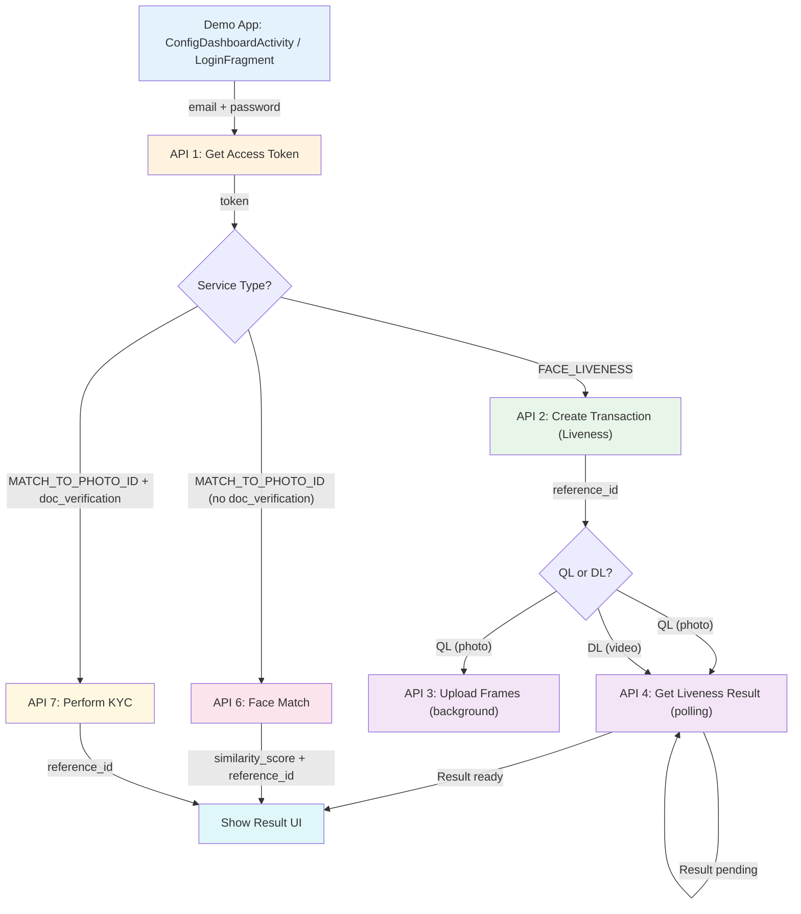

# Facia Android SDK — API Reference

> **Base URL:** `https://api.facia.ai/`
> **SDK Version:** `android-core 3.3.3`
> **Total Active APIs:** 7 (1 in demo app + 6 in SDK)

---

## Summary Table

| # | API Name | Endpoint | Method | Content-Type | Module | Caller File |
|---|----------|----------|--------|--------------|--------|-------------|
| 1 | Get Access Token | `request-access-token` | POST | `application/json` | Demo App | [ApiHelper.java](file:///Users/saadafzaal/Automation%20/PF/gitlab/facia_android_sdk/app/src/main/java/com/facia/faciademo/Login/ApiHelper.java) |
| 2 | Create Transaction (Liveness) | `liveness` | POST | `multipart/form-data` | SDK | [LivenessApiHelper.java](file:///Users/saadafzaal/Automation%20/PF/gitlab/facia_android_sdk/Facia/src/main/java/com/facia/faciasdk/Camera/ApiHelpers/LivenessApiHelper.java) |
| 3 | Upload Frames | `upload-frames` | POST | `application/json` | SDK | [LivenessApiHelper.java](file:///Users/saadafzaal/Automation%20/PF/gitlab/facia_android_sdk/Facia/src/main/java/com/facia/faciasdk/Camera/ApiHelpers/LivenessApiHelper.java) |
| 4 | Get Liveness Result | `result` | POST | `application/json` | SDK | [LivenessApiHelper.java](file:///Users/saadafzaal/Automation%20/PF/gitlab/facia_android_sdk/Facia/src/main/java/com/facia/faciasdk/Camera/ApiHelpers/LivenessApiHelper.java) |
| 5 | Check Liveness (DL Video) | `check-liveness` | POST | `multipart/form-data` | SDK | [LivenessApiHelper.java](file:///Users/saadafzaal/Automation%20/PF/gitlab/facia_android_sdk/Facia/src/main/java/com/facia/faciasdk/Camera/ApiHelpers/LivenessApiHelper.java) |
| 6 | Face Match (Similarity) | `face-match` | POST | `multipart/form-data` | SDK | [SimilarityApiHelper.java](file:///Users/saadafzaal/Automation%20/PF/gitlab/facia_android_sdk/Facia/src/main/java/com/facia/faciasdk/Camera/ApiHelpers/SimilarityApiHelper.java) |
| 7 | Perform KYC | `kyc` | POST | `application/json` | SDK | [SimilarityApiHelper.java](file:///Users/saadafzaal/Automation%20/PF/gitlab/facia_android_sdk/Facia/src/main/java/com/facia/faciasdk/Camera/ApiHelpers/SimilarityApiHelper.java) |

---

## API Flow Diagram



---

## API 1: Get Access Token

> **Module:** Demo App  
> **File:** [ApiHelper.java:L112-L155](file:///Users/saadafzaal/Automation%20/PF/gitlab/facia_android_sdk/app/src/main/java/com/facia/faciademo/Login/ApiHelper.java#L112-L155)  
> **Interface:** [ApiInterface.java:L13](file:///Users/saadafzaal/Automation%20/PF/gitlab/facia_android_sdk/app/src/main/java/com/facia/faciademo/ApiCalling/ApiInterface.java#L13)

### Endpoint
```
POST https://api.facia.ai/request-access-token
```

### Headers
| Header | Value |
|--------|-------|
| Content-Type | `application/json` |

### Request Payload
```json
{
  "email": "user@example.com",
  "password": "user_password"
}
```

### Response Model — `GetToken`
```json
{
  "status": true,
  "message": "Token generated successfully",
  "result": {
    "data": {
      "token": "eyJhbGciOiJIUzI1NiIsInR5cCI6IkpXVCJ9..."
    }
  }
}
```

### Error Response
```json
{
  "status": false,
  "message": "Validation error",
  "errors": {
    "email": ["The email field is required."],
    "password": ["The password field is required."]
  }
}
```

### Response Model Files
- [GetToken.java](file:///Users/saadafzaal/Automation%20/PF/gitlab/facia_android_sdk/app/src/main/java/com/facia/faciademo/ApiCalling/GetToken/GetToken.java) — `status`, `message`, `result`, `errors`
- [Result.java](file:///Users/saadafzaal/Automation%20/PF/gitlab/facia_android_sdk/app/src/main/java/com/facia/faciademo/ApiCalling/GetToken/Result.java) — `data`
- [Data.java](file:///Users/saadafzaal/Automation%20/PF/gitlab/facia_android_sdk/app/src/main/java/com/facia/faciademo/ApiCalling/GetToken/Data.java) — `token`

---

## API 2: Create Transaction (Liveness)

> **Module:** SDK  
> **File:** [LivenessApiHelper.java:L57-L164](file:///Users/saadafzaal/Automation%20/PF/gitlab/facia_android_sdk/Facia/src/main/java/com/facia/faciasdk/Camera/ApiHelpers/LivenessApiHelper.java#L57-L164)  
> **Interface:** [ApiInterface.java:L19-L23](file:///Users/saadafzaal/Automation%20/PF/gitlab/facia_android_sdk/Facia/src/main/java/com/facia/faciasdk/ApiModels/ApiInterface.java#L19-L23)

### Endpoint
```
POST https://api.facia.ai/liveness
```

### Headers
| Header | Value |
|--------|-------|
| Authorization | `Bearer {token}` |
| user-agent | Device details string |
| platform | `android` |

### Request Payload — `multipart/form-data`
| Field | Type | Description | Source |
|-------|------|-------------|--------|
| `type` | String | Always `"liveness"` | Hardcoded |
| `file_type` | String | `"video"` (DL) or `"photo"` (QL) | Based on liveness type |
| `is_proof_captured` | String | Always `"1"` | Hardcoded |
| `client_reference` | String | Optional, from config | `configObject.getString("clientReference")` |
| `device_id` | String | Android device ID | `Utilities.SimilarMethods.getDeviceId()` |
| `file` | File | Captured face image/video | Camera capture |

> [!NOTE]
> `client_reference` is only added when the service type is NOT `MATCH_TO_PHOTO_ID` and the value is non-empty.

### Response Model — `CreateTransaction`
```json
{
  "status": true,
  "message": "Transaction created successfully",
  "result": {
    "data": {
      "reference_id": "abc123-def456-ghi789"
    }
  }
}
```

### Response Model Files
- [CreateTransaction.java](file:///Users/saadafzaal/Automation%20/PF/gitlab/facia_android_sdk/Facia/src/main/java/com/facia/faciasdk/ApiModels/CreateTransaction/CreateTransaction.java) — `status`, `message`, `result`
- [Data.java](file:///Users/saadafzaal/Automation%20/PF/gitlab/facia_android_sdk/Facia/src/main/java/com/facia/faciasdk/ApiModels/CreateTransaction/Data.java) — `reference_id`

### What Happens After Success
- **QL flow:** Triggers API 3 (Upload Frames) in background + API 4 (Get Result) polling
- **DL flow:** Triggers API 4 (Get Result) polling after a delay

---

## API 3: Upload Frames (Background)

> **Module:** SDK  
> **File:** [LivenessApiHelper.java:L166-L194](file:///Users/saadafzaal/Automation%20/PF/gitlab/facia_android_sdk/Facia/src/main/java/com/facia/faciasdk/Camera/ApiHelpers/LivenessApiHelper.java#L166-L194) (API call) + [L487-L507](file:///Users/saadafzaal/Automation%20/PF/gitlab/facia_android_sdk/Facia/src/main/java/com/facia/faciasdk/Camera/ApiHelpers/LivenessApiHelper.java#L487-L507) (payload builder)  
> **Interface:** [ApiInterface.java:L42-L46](file:///Users/saadafzaal/Automation%20/PF/gitlab/facia_android_sdk/Facia/src/main/java/com/facia/faciasdk/ApiModels/ApiInterface.java#L42-L46)

### Endpoint
```
POST https://api.facia.ai/upload-frames
```

### Headers
| Header | Value |
|--------|-------|
| Authorization | `Bearer {token}` |
| user-agent | Device details string |
| platform | `android` |

### Request Payload — `application/json`
```json
{
  "reference_id": "abc123-def456-ghi789",
  "proof_type": "video_frames",
  "device_id": "8856ed50207688a7",
  "proof_frames": [
    "base64_frame_1...",
    "base64_frame_2...",
    "..."
  ]
}
```

| Field | Type | Description | Source |
|-------|------|-------------|--------|
| `reference_id` | String | From API 2 response | `SingletonData.getInstance().getReferenceId()` |
| `proof_type` | String | Always `"video_frames"` | Hardcoded |
| `device_id` | String | Android device ID | `Utilities.SimilarMethods.getDeviceId()` |
| `proof_frames` | JsonArray | Array of base64-encoded frames | `SingletonData.getInstance().getQlFrameList()` |

### Response Model — `UploadQlVideo`
```json
{
  "status": true,
  "message": "Frames uploaded successfully"
}
```

### Response Model Files
- [UploadQlVideo.java](file:///Users/saadafzaal/Automation%20/PF/gitlab/facia_android_sdk/Facia/src/main/java/com/facia/faciasdk/ApiModels/UploadQlVideo/UploadQlVideo.java) — `status`, `message`

> [!NOTE]
> This runs in a background thread (`uploadFrameListInBg`). Only triggered for **Quick Liveness (QL)** flow. Response is not used for UI decisions.

---

## API 4: Get Liveness Result (Polling)

> **Module:** SDK  
> **File:** [LivenessApiHelper.java:L263-L322](file:///Users/saadafzaal/Automation%20/PF/gitlab/facia_android_sdk/Facia/src/main/java/com/facia/faciasdk/Camera/ApiHelpers/LivenessApiHelper.java#L263-L322)  
> **Interface:** [ApiInterface.java:L48-L52](file:///Users/saadafzaal/Automation%20/PF/gitlab/facia_android_sdk/Facia/src/main/java/com/facia/faciasdk/ApiModels/ApiInterface.java#L48-L52)

### Endpoint
```
POST https://api.facia.ai/result
```

### Headers
| Header | Value |
|--------|-------|
| Authorization | `Bearer {token}` |
| user-agent | Device details string |
| platform | `android` |

### Request Payload — `application/json`
```json
{
  "reference_id": "abc123-def456-ghi789"
}
```

### Response Model — `Result`
```json
{
  "status": true,
  "message": "Result retrieved",
  "result": {
    "data": {
      "_id": "64a...",
      "video_id": "vid_123",
      "merchant_id": 100,
      "reference_id": "abc123-def456-ghi789",
      "callback_url": "https://...",
      "type": "liveness",
      "updated_at": "2025-01-01T00:00:00Z",
      "created_at": "2025-01-01T00:00:00Z",
      "main_cluster_assign_at": { "$date": "..." },
      "main_cluster_id": "cluster_1",
      "No_face": false,
      "cluster_assign_at": "2025-01-01T00:00:00Z",
      "cluster_id": "cluster_2",
      "face": true,
      "is_request_original": 1,
      "ml_request_finalized_at": "2025-01-01T00:00:00Z",
      "ml_request_status": "completed",
      "decline_reason": "",
      "face_match": {
        "similarity_score": 0.95,
        "similarity_status": 1
      },
      "quick_liveness_response": 1
    }
  }
}
```

### Key Response Fields Used by SDK

| Field | Used For | QL | DL |
|-------|----------|----|----|
| `quick_liveness_response` | `1` = verified, else unverified | ✅ | ❌ |
| `is_request_original` | `1` = verified, `0` = unverified | ❌ | ✅ |
| `decline_reason` | Shown when `showDeclineReason` is true | ✅ | ✅ |
| `reference_id` | Stored for callback | ✅ | ✅ |

### Response Model Files
- [Result.java](file:///Users/saadafzaal/Automation%20/PF/gitlab/facia_android_sdk/Facia/src/main/java/com/facia/faciasdk/ApiModels/Result/Result.java) — `status`, `message`, `result`
- [Data.java](file:///Users/saadafzaal/Automation%20/PF/gitlab/facia_android_sdk/Facia/src/main/java/com/facia/faciasdk/ApiModels/Result/Data.java) — Full result data with 17+ fields

> [!IMPORTANT]
> This API is called in a **polling loop** — up to **30 times** until `quick_liveness_response` (QL) or `is_request_original` (DL) is non-null. If result is still null after 30 calls, an error is logged via webhooks.

---

## API 5: Check Liveness (DL Video Upload)

> **Module:** SDK  
> **File:** [LivenessApiHelper.java:L202-L258](file:///Users/saadafzaal/Automation%20/PF/gitlab/facia_android_sdk/Facia/src/main/java/com/facia/faciasdk/Camera/ApiHelpers/LivenessApiHelper.java#L202-L258)  
> **Interface:** [ApiInterface.java:L60-L64](file:///Users/saadafzaal/Automation%20/PF/gitlab/facia_android_sdk/Facia/src/main/java/com/facia/faciasdk/ApiModels/ApiInterface.java#L60-L64)

### Endpoint
```
POST https://api.facia.ai/check-liveness
```

### Headers
| Header | Value |
|--------|-------|
| Authorization | `Bearer {token}` |
| user-agent | Device details string |
| platform | `android` |

### Request Payload — `multipart/form-data`
| Field | Type | Description | Source |
|-------|------|-------------|--------|
| `reference_id` | String | From API 2 response | `SingletonData.getInstance().getReferenceId()` |
| `merchant_redirect_url` | String | Always `"www.google.com"` | Hardcoded |
| `file` | File | DL video file | Camera recording |

### Response Model — `LivenessRequest`
```json
{
  "status": true,
  "message": "Liveness check initiated"
}
```

### Response Model Files
- [LivenessRequest.java](file:///Users/saadafzaal/Automation%20/PF/gitlab/facia_android_sdk/Facia/src/main/java/com/facia/faciasdk/ApiModels/LivenessRequest/LivenessRequest.java) — `status`, `message`, `result`
- [Data.java](file:///Users/saadafzaal/Automation%20/PF/gitlab/facia_android_sdk/Facia/src/main/java/com/facia/faciasdk/ApiModels/LivenessRequest/Data.java) — `email`, `$oid`

### What Happens After Success
- Triggers API 4 (Get Liveness Result) polling after a delay

---

## API 6: Face Match (Check Similarity)

> **Module:** SDK  
> **File:** [SimilarityApiHelper.java:L49-L83](file:///Users/saadafzaal/Automation%20/PF/gitlab/facia_android_sdk/Facia/src/main/java/com/facia/faciasdk/Camera/ApiHelpers/SimilarityApiHelper.java#L49-L83) (payload) + [L90-L146](file:///Users/saadafzaal/Automation%20/PF/gitlab/facia_android_sdk/Facia/src/main/java/com/facia/faciasdk/Camera/ApiHelpers/SimilarityApiHelper.java#L90-L146) (API call)  
> **Interface:** [ApiInterface.java:L54-L58](file:///Users/saadafzaal/Automation%20/PF/gitlab/facia_android_sdk/Facia/src/main/java/com/facia/faciasdk/ApiModels/ApiInterface.java#L54-L58)  
> **Called from:** [HelperFunctions.java:L574-L585](file:///Users/saadafzaal/Automation%20/PF/gitlab/facia_android_sdk/Facia/src/main/java/com/facia/faciasdk/Camera/HelperFunctions.java#L574-L585)

### Endpoint
```
POST https://api.facia.ai/face-match
```

### Headers
| Header | Value |
|--------|-------|
| Authorization | `Bearer {token}` |
| user-agent | Device details string |
| platform | `android` |

### Request Payload — `multipart/form-data`
| Field | Type | Description | Source |
|-------|------|-------------|--------|
| `type` | String | Always `"photo_id_match"` | Hardcoded |
| `face_frame` | File (image) | Face image captured by camera | `requestModel.getFaceImage()` |
| `client_reference` | String | Optional, from config | `configObject.getString("clientReference")` |
| `device_id` | String | Android device ID | `Utilities.SimilarMethods.getDeviceId()` |
| `id_frame` | File (image) | Document/ID image | `requestModel.getIdImage()` |

### Response Model — `CheckSimilarity`
```json
{
  "status": true,
  "message": "Face match completed",
  "result": {
    "data": {
      "reference_id": "abc123-def456-ghi789",
      "similarity_score": 0.92,
      "similarity_status": 1
    }
  }
}
```

### Key Response Fields Used by SDK

| Field | Type | Description |
|-------|------|-------------|
| `reference_id` | String | Stored via `SingletonData.setReferenceId()` |
| `similarity_score` | Double | Compared against threshold for match decision |
| `similarity_status` | Integer | `1` = matched, `0` = not matched (used when `isCaptured=true`) |

### Response Model Files
- [CheckSimilarity.java](file:///Users/saadafzaal/Automation%20/PF/gitlab/facia_android_sdk/Facia/src/main/java/com/facia/faciasdk/ApiModels/CheckSimilarity/CheckSimilarity.java) — `status`, `message`, `result`
- [Data.java](file:///Users/saadafzaal/Automation%20/PF/gitlab/facia_android_sdk/Facia/src/main/java/com/facia/faciasdk/ApiModels/CheckSimilarity/Data.java) — `reference_id`, `similarity_score`, `similarity_status`

> [!NOTE]
> This API is used when `photo_id_match=true` but `doc_verification=false`. Only sends face + ID images without document OCR/verification.

---

## API 7: Perform KYC (Full Document Verification)

> **Module:** SDK  
> **File:** [SimilarityApiHelper.java:L252-L401](file:///Users/saadafzaal/Automation%20/PF/gitlab/facia_android_sdk/Facia/src/main/java/com/facia/faciasdk/Camera/ApiHelpers/SimilarityApiHelper.java#L252-L401) (payload) + [L406-L471](file:///Users/saadafzaal/Automation%20/PF/gitlab/facia_android_sdk/Facia/src/main/java/com/facia/faciasdk/Camera/ApiHelpers/SimilarityApiHelper.java#L406-L471) (API call)  
> **Interface:** [ApiInterface.java:L66-L71](file:///Users/saadafzaal/Automation%20/PF/gitlab/facia_android_sdk/Facia/src/main/java/com/facia/faciasdk/ApiModels/ApiInterface.java#L66-L71)  
> **Called from:** [HelperFunctions.java:L1016-L1044](file:///Users/saadafzaal/Automation%20/PF/gitlab/facia_android_sdk/Facia/src/main/java/com/facia/faciasdk/Camera/HelperFunctions.java#L1016-L1044)

### Endpoint
```
POST https://api.facia.ai/kyc
```

### Headers
| Header | Value |
|--------|-------|
| Authorization | `Bearer {token}` |
| user-agent | Device details string |
| platform | `android` |

### Request Payload — `application/json`
```json
{
  "services": [
    "quick_liveness",
    "document_ocr",
    "document_verification",
    "face_match",
    "aml",
    "address_verification"
  ],
  "quick_liveness": {
    "file": "data:image/jpeg;base64,/9j/4AAQ..."
  },
  "document": {
    "file": "data:image/jpeg;base64,/9j/4AAQ...",
    "additional_file": "data:image/jpeg;base64,/9j/4AAQ...",
    "supported_types": [
      "id_card",
      "passport",
      "driving_license"
    ]
  },
  "document_two": {
    "file": "data:image/jpeg;base64,/9j/4AAQ...",
    "additional_file": "data:image/jpeg;base64,/9j/4AAQ..."
  },
  "address": {
    "file": "data:image/jpeg;base64,/9j/4AAQ...",
    "additional_file": "data:image/jpeg;base64,/9j/4AAQ..."
  },
  "device_id": "8856ed50207688a7",
  "client_reference": "d793fceb-5107-4143-b9eb-32d0d4cbf87f"
}
```

### Payload Field Breakdown

| Field | Type | Condition | Source (Line in SimilarityApiHelper.java) |
|-------|------|-----------|-------------------------------------------|
| `services` | JSONArray | Always present | [L296-L317](file:///Users/saadafzaal/Automation%20/PF/gitlab/facia_android_sdk/Facia/src/main/java/com/facia/faciasdk/Camera/ApiHelpers/SimilarityApiHelper.java#L296-L317) — hardcoded list |
| `services["aml"]` | String | Only if `doc_AML=true` | [L302-L304](file:///Users/saadafzaal/Automation%20/PF/gitlab/facia_android_sdk/Facia/src/main/java/com/facia/faciasdk/Camera/ApiHelpers/SimilarityApiHelper.java#L302-L304) — `configObject.optBoolean("doc_AML")` |
| `services["address_verification"]` | String | Only if address images exist | [L315-L317](file:///Users/saadafzaal/Automation%20/PF/gitlab/facia_android_sdk/Facia/src/main/java/com/facia/faciasdk/Camera/ApiHelpers/SimilarityApiHelper.java#L315-L317) |
| `quick_liveness.file` | String (base64) | Always | [L321-L323](file:///Users/saadafzaal/Automation%20/PF/gitlab/facia_android_sdk/Facia/src/main/java/com/facia/faciasdk/Camera/ApiHelpers/SimilarityApiHelper.java#L321-L323) — face image |
| `document.file` | String (base64) | Always | [L326](file:///Users/saadafzaal/Automation%20/PF/gitlab/facia_android_sdk/Facia/src/main/java/com/facia/faciasdk/Camera/ApiHelpers/SimilarityApiHelper.java#L326) — ID front |
| `document.additional_file` | String (base64) | If back image exists | [L327-L329](file:///Users/saadafzaal/Automation%20/PF/gitlab/facia_android_sdk/Facia/src/main/java/com/facia/faciasdk/Camera/ApiHelpers/SimilarityApiHelper.java#L327-L329) — ID back |
| `document.supported_types` | JSONArray | Always | [L332-L336](file:///Users/saadafzaal/Automation%20/PF/gitlab/facia_android_sdk/Facia/src/main/java/com/facia/faciasdk/Camera/ApiHelpers/SimilarityApiHelper.java#L332-L336) — hardcoded |
| `document_two.file` | String (base64) | If doc two front exists | [L341-L352](file:///Users/saadafzaal/Automation%20/PF/gitlab/facia_android_sdk/Facia/src/main/java/com/facia/faciasdk/Camera/ApiHelpers/SimilarityApiHelper.java#L341-L352) |
| `document_two.additional_file` | String (base64) | If doc two back exists | Same block |
| `address.file` | String (base64) | If address front exists | [L355-L367](file:///Users/saadafzaal/Automation%20/PF/gitlab/facia_android_sdk/Facia/src/main/java/com/facia/faciasdk/Camera/ApiHelpers/SimilarityApiHelper.java#L355-L367) |
| `address.additional_file` | String (base64) | If address back exists | Same block |
| `device_id` | String | Always | [L369](file:///Users/saadafzaal/Automation%20/PF/gitlab/facia_android_sdk/Facia/src/main/java/com/facia/faciasdk/Camera/ApiHelpers/SimilarityApiHelper.java#L369) |
| `client_reference` | String | If non-empty | [L371-L376](file:///Users/saadafzaal/Automation%20/PF/gitlab/facia_android_sdk/Facia/src/main/java/com/facia/faciasdk/Camera/ApiHelpers/SimilarityApiHelper.java#L371-L376) |

> [!WARNING]
> The KYC payload is built as a **brand new `JSONObject`** at [line 294](file:///Users/saadafzaal/Automation%20/PF/gitlab/facia_android_sdk/Facia/src/main/java/com/facia/faciasdk/Camera/ApiHelpers/SimilarityApiHelper.java#L294). It does NOT merge or copy the `configObject`. Only `doc_AML` and `clientReference` are read from the config. Any new fields like `risk_profile` added to the config will **NOT** automatically appear in this payload — they must be explicitly added.

### Response Model — `KycResponse`
```json
{
  "status": true,
  "message": "KYC transaction created successfully",
  "result": {
    "data": {
      "reference_id": "abc123-def456-ghi789"
    }
  }
}
```

### Error Response
```json
{
  "status": false,
  "message": "Validation failed",
  "errors": {
    "client_reference": ["The client reference is invalid."]
  }
}
```

### Response Model Files
- [KycResponse.java](file:///Users/saadafzaal/Automation%20/PF/gitlab/facia_android_sdk/Facia/src/main/java/com/facia/faciasdk/ApiModels/PerformKYC/KycResponse.java) — `status`, `message`, `result`
- [KycResult.java](file:///Users/saadafzaal/Automation%20/PF/gitlab/facia_android_sdk/Facia/src/main/java/com/facia/faciasdk/ApiModels/PerformKYC/KycResult.java) — `data`
- [KycData.java](file:///Users/saadafzaal/Automation%20/PF/gitlab/facia_android_sdk/Facia/src/main/java/com/facia/faciasdk/ApiModels/PerformKYC/KycData.java) — `reference_id`

---

## Common Headers (All SDK APIs)

All SDK APIs (APIs 2–7) share the same header pattern:

```java
@Header("Authorization")  → "Bearer " + token
@Header("user-agent")     → Utilities.SimilarMethods.getDeviceDetails()
@Header("platform")       → "android"
```

---

## Common Error Response Structure

All APIs return errors in a consistent format:

```json
{
  "status": false,
  "message": "Error description",
  "errors": {
    "field_name": ["Validation error message"]
  }
}
```

The SDK checks for `errors.client_reference` specifically and handles limit-exceeded errors (HTTP 400 with "limit" in message) by navigating to a trial-end screen.

---

## Config Object → API Payload Mapping

This table shows which config keys from [ConfigDashboardActivity.setConfig()](file:///Users/saadafzaal/Automation%20/PF/gitlab/facia_android_sdk/app/src/main/java/com/facia/faciademo/Login/ConfigDashboardActivity.java#L465-L511) actually reach the API payloads:

| Config Key | Used in API Payload? | Which API? | How? |
|------------|---------------------|------------|------|
| `clientReference` | ✅ | APIs 2, 6, 7 | Passed as method param from `requestModel.getConfigObject()` |
| `doc_AML` | ✅ | API 7 (KYC) | Read at [L292](file:///Users/saadafzaal/Automation%20/PF/gitlab/facia_android_sdk/Facia/src/main/java/com/facia/faciasdk/Camera/ApiHelpers/SimilarityApiHelper.java#L292) to add `"aml"` to services |
| `photo_id_match` | ❌ (routing only) | — | Determines whether API 6 or 7 is called |
| `doc_verification` | ❌ (routing only) | — | Determines whether API 6 or 7 is called |
| `livenessType` | ❌ (UI only) | — | Determines QL vs DL camera flow |
| `showResult` | ❌ (UI only) | — | Controls result screen visibility |
| All other booleans | ❌ (UI/behavior only) | — | Used for SDK UI/flow control |

> [!CAUTION]
> If you add new fields like `risk_profile` to the config object, they will be stored in `requestModel.configObject` and accessible throughout the SDK, but they will **NOT** be sent in any API payload unless you explicitly add them in the payload-building methods (`performKycJsonObject`, `createRequestJsonObject`, or `checkSimilarityJsonObject`).
